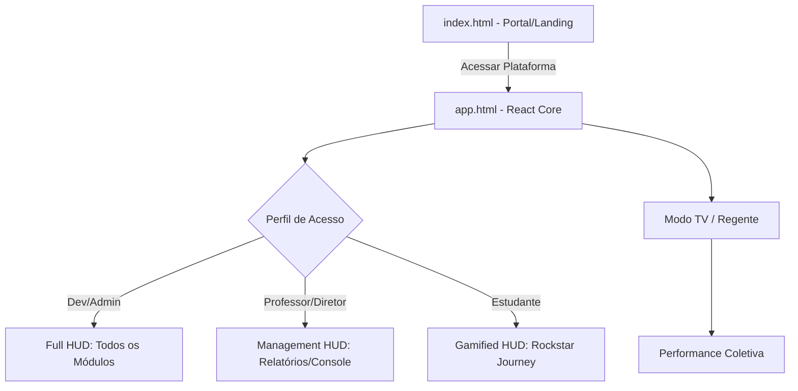
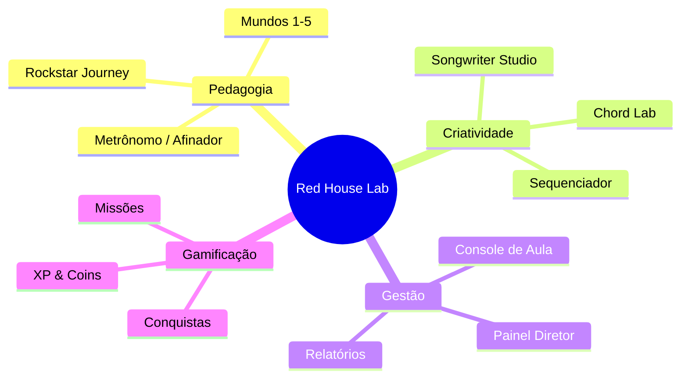

# 🗺️ Red House Music Lab: Application Map

Este documento fornece uma visão arquitetural e pedagógica da plataforma **OlieMusic / GCM Maestro**.

---

## 🏗️ Fluxo de Navegação (High-Level)
O portal central serve como o gateway tanto para a visão institucional quanto para o centro operacional.



---

## 🧩 Hierarquia de Módulos
Organização das funcionalidades centrais por pilar pedagógico.



---

## 🔐 Matriz de Acesso (RBAC)
Como as funcionalidades são filtradas de acordo com o perfil.

```mermaid
matrix
    title "Permissões de Acesso por Perfil"
    columns: "Funcionalidade" | "Student" | "Teacher" | "Director" | "Dev/Admin"
    "Rockstar Journey" | "✅" | "✅" | "❌" | "✅"
    "XP & Coins Metrics" | "✅" | "❌" | "❌" | "✅"
    "Console de Aula" | "❌" | "✅" | "❌" | "✅"
    "Relatórios Mensais" | "❌" | "✅" | "✅" | "✅"
    "Painel Diretor" | "❌" | "❌" | "✅" | "✅"
    "Config. Sistema" | "❌" | "❌" | "❌" | "✅"
```

---

## 🚀 Engine Técnica
- **Frontend:** React 19 + Vite + Tailwind CSS 4
- **Animations:** Framer Motion
- **Sound Engine:** Tone.js
- **Backend:** Firebase (Auth/Firestore)
- **Deployment:** Vercel
